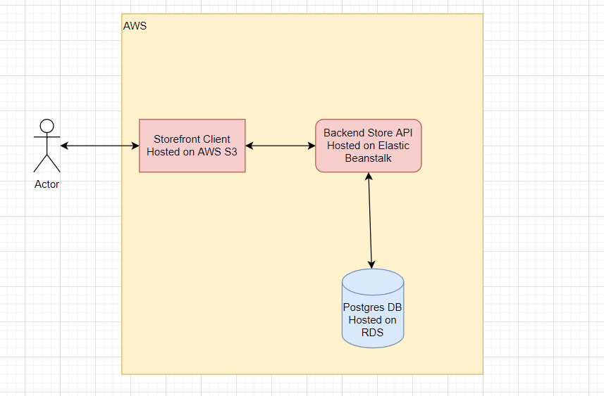

# Store

This project isthe project from the Udacity FullStack JavaScript nanodegree.

The project is available at the following URL:

http://storefront-frontend.s3-website-us-east-1.amazonaws.com/

### Elastic Beanstalk 

###  S3 

### Postgres

### Pipeline

### Pipeline Flow

### Architecture

## License

[License](LICENSE.txt)